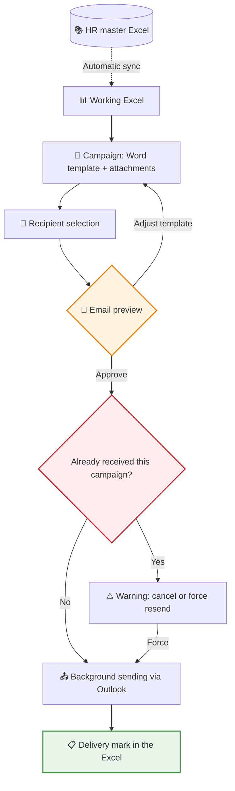
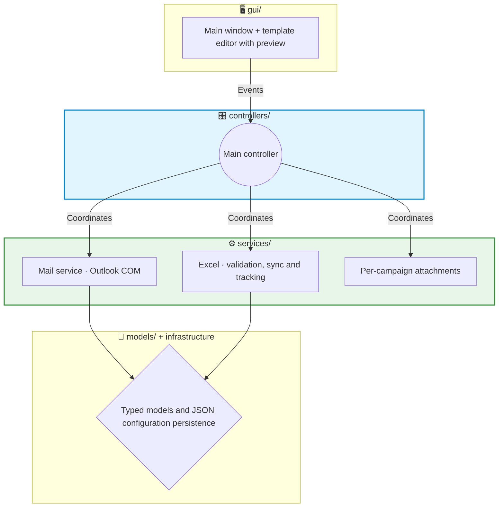

# 📧 Showcase: Email Auto — Personalized, duplicate-free HR communications

This project is a desktop application that automates recurring HR communications (welcomes, birthdays, training, access, uniforms...) by personalizing them for each recipient. It reads the data from the Excel file HR already maintains, fills in corporate Word templates, shows a faithful preview of the email and sends it from the user's own Outlook, recording the delivery in that same Excel file so that nobody receives the same communication twice.

> [!NOTE]
> **Confidentiality Notice**
> Since this project was developed for a company, certain internal details, templates and parts of the code are protected by confidentiality. However, in this document I explain in broad terms the main structure and how the application works.

## 🔎 What does the application do?

Recurring HR communications repeat every week: same texts, different name, different date. Doing it by hand takes hours and produces awkward mistakes — the classic "María got Juan's email". With this tool:

- The data is loaded from the usual Excel file, and each email is filled in only with its recipient's data.
- Each type of communication is a **campaign** configurable from the app itself: its Word template, its fixed attachments and its tracking column in the Excel file. HR can create or delete campaigns without touching code.
- Before sending anything, you see the email **exactly** as the person will receive it: their name, their data, their attachments.
- Emails are sent from the user's Outlook (their account or a configured shared mailbox), with a default CC, to the corporate or personal email depending on the case.
- Everything is recorded: each delivery is marked in the campaign's column within the Excel file and, if someone tries to repeat it, the app warns before resending — in addition to the native copy in the Sent folder.

## 🔄 Workflow

The preview renders the HTML resulting from merging the template with the Excel row, including the per-profile attachments. It is the quality check before hitting send: what gets approved is what arrives.

## 🏗️ Project Architecture

The application was born as a quick tool and survived its own success: real-world use forced (and justified) a **complete refactor from a monolithic script to a layered architecture** in V2.0, with separated responsibilities and a test suite as a safety net.

1. 🖥️ **GUI (`gui/`)**: presentation only. It includes the template editor with preview (`.docx` → HTML conversion with mammoth) and delegates every action to the controllers.
2. 🎛️ **Controllers (`controllers/`)**: they coordinate the whole flow — they receive events from the GUI, query services, launch the sending worker and return results to the screen.
3. ⚙️ **Services and business logic**: integration with Outlook via COM (`OutlookService`), validation of the recipients' Excel, synchronization with the master Excel (`ExcelSyncService`), delivery logging (`TrackingManager`) and per-campaign attachment management. `OutlookService` is pure Python, separate from the Qt worker: this way it can be *mocked* in tests without any risk of sending real emails.
4. 📐 **Models and infrastructure**: explicit data structures instead of loose dictionaries (shape errors are caught early) and JSON persistence of the user's configuration, with its own tests.

## ✨ Key Technical Features

*   🔐 **Outlook COM instead of SMTP**: sending is done through the desktop Outlook client (COM automation with **pywin32**). The consequences of this decision are very valuable in a corporate environment: zero credentials to store, the sender's real identity, deliveries stay in the mailbox (native auditing) and tenant policies are respected without registering applications in Azure.
*   🔁 **Delivery idempotency**: before sending, the app checks the Excel file to see whether that person has already received that campaign. If so, it shows a warning with "Cancel" as the default option and requires explicit confirmation to resend. After a successful delivery, it marks the corresponding cell, and if the Excel file is open and locked by another user it detects this and warns instead of failing silently.
*   ⚡ **Asynchronous sending with QThread**: a dedicated worker runs the sending outside the interface thread and reports progress and errors through Qt signals, with the COM cycle (`CoInitialize` / `CoUninitialize`) properly closed in its own thread. The GUI never freezes while Outlook is working.
*   📝 **Word templates owned by HR**: the templates are `.docx` files with placeholders (**docxtpl**) that are converted to email HTML with **mammoth**. The texts are maintained by the business user, in Word, with no development cycle in between.
*   👀 **Hot Excel synchronization**: a watcher (**watchdog**) monitors HR's master Excel and, when it changes, cross-references its data with the working Excel using primary keys (personal email / corporate email): it updates existing records, inserts new hires and detects orphans, and shows an on-screen summary of the changes. The watcher is paused while the app writes the tracking, so it does not react to its own changes. Parsing also normalizes headers and tolerates the typical irregularities of a hand-maintained Excel file.
*   📎 **Per-campaign attachments with limits**: each campaign stores its own attachments (PDF or Excel) in an app folder, validated by type, maximum number of files and configurable total size, so that no email gets stuck in Outlook for being too large.
*   🧪 **Test-backed refactor**: the evolution from V0.2 → V2.0.3 (10 published builds) was done on top of a suite of **19 tests** (pytest) covering configuration and its persistence, the sending worker, security and the template system — the safety net that made it possible to refactor without breaking anything.

## 📈 Product evolution

| Version | Milestone |
|---|---|
| V0.2 | First useful version in internal production |
| V0.2.1 – V0.2.3 | Stabilization and fixes with real use |
| V1.0 | Consolidated product |
| V2.0 | Complete refactor to a layered architecture |
| V2.0.1 – V2.0.3 | Post-refactor hardening (current version) |

## 🚀 Project Status

It is the application with the longest track record in the portfolio (~3,000 lines) and a mature product in internal use. Today, sending, templates and configuration are covered by tests. The natural next steps are to extend test coverage to the controllers and Excel synchronization, add batch sending to several recipients in a single pass (today the flow is one email per recipient, with a preview and duplicate check for each one) and consider a retry queue for failed deliveries.

---

**Iván Herrero - AI & Automation Specialist**
