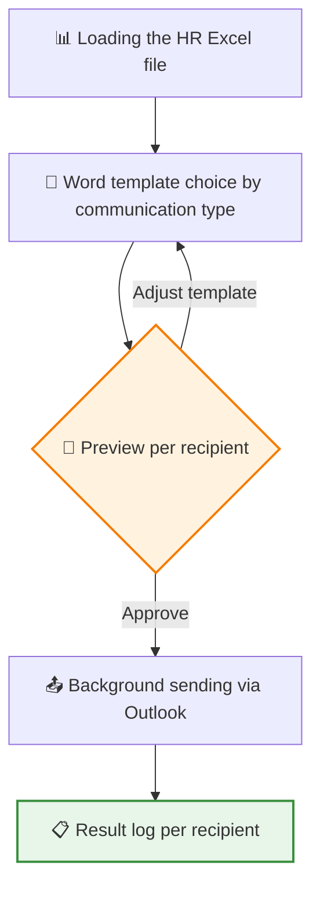
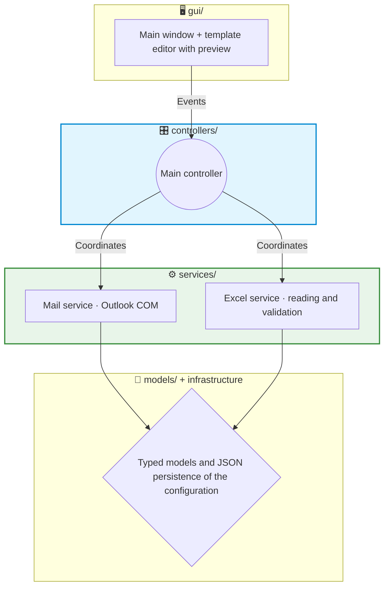

# 📧 Showcase: Email Auto — Personalised HR communications at scale

This project is a desktop application that automates recurring HR communications (welcome messages, birthdays, training, access rights, uniforms...) personalising them per recipient. It reads the data from the Excel file HR already maintains, fills in corporate Word templates, shows a faithful preview of every email and sends them from the user's own Outlook, leaving a record of each delivery.

> [!NOTE]
> **Confidentiality Notice**
> As this is a project developed for a company, certain internal details, templates and parts of the code are protected by confidentiality. However, in this document I explain in broad terms the main structure and how the application works.

## 🔎 What does the application do?

Recurring HR communications repeat every week: same texts, different name, different date. Doing it by hand takes hours and produces awkward mistakes — the classic "María got Juan's email". With this tool:

- The data is loaded from the usual Excel file, and each email is filled in only with its recipient's data.
- Before anything is sent, you see the email **exactly** as each person will receive it: their name, their data, their attachments.
- The emails go out from the user's corporate Outlook account, as if they had written them.
- Everything is logged: what was sent, to whom and with what result — plus the native copy in the Sent folder.

## 🔄 Workflow

The preview renders the HTML resulting from merging the template with the Excel row, including the attachments for that profile. It is the quality control before the trigger: what is approved is what arrives.

## 🏗️ Project Architecture

The application started as a quick tool and survived its own success: real usage forced (and justified) a **complete refactor from monolithic script to layered architecture** in V2.0, with separated responsibilities and a test suite as a safety net.

1. 🖥️ **GUI (`gui/`)**: presentation only. It includes the template editor with preview (`.docx` → HTML conversion with mammoth) and delegates every action to the controllers.
2. 🎛️ **Controllers (`controllers/`)**: they coordinate the whole flow — they receive GUI events, query services, launch the sending worker and return results to the screen.
3. ⚙️ **Services (`services/`)**: the business logic — Outlook integration via COM and reading/validation of the recipients' Excel file. With no GUI dependencies: they are testable in isolation, and that is how they are tested.
4. 📐 **Models and infrastructure**: explicit data structures instead of loose dictionaries (shape errors are caught early) and JSON persistence of the user's configuration, with its own tests.

## ✨ Technical Highlights

*   🔐 **Outlook COM instead of SMTP**: sending is done through the desktop Outlook client (COM automation with **pywin32**). The consequences of this decision are very valuable in a corporate environment: zero credentials to store, a real sender identity, the sent messages stay in the mailbox (native audit trail) and tenant policies are respected without registering applications in Azure.
*   ⚡ **Asynchronous sending with QThread**: a dedicated worker runs the deliveries outside the interface thread, reporting progress through Qt signals. The GUI never freezes, not even with large batches — the computer stays usable throughout the process.
*   📝 **Word templates owned by HR**: the templates are `.docx` files with placeholders (**docxtpl**) that are converted to email HTML with **mammoth**. The person maintaining the texts is the business user, in Word, with no development cycle in between.
*   👀 **Live Excel watching**: a watcher (**watchdog**) detects changes to the file while the application is open, so it never works with stale data. The parser also tolerates the irregularities typical of a hand-maintained Excel file.
*   🧪 **Refactor backed by tests**: the V0.2 → V2.0.3 evolution (10 published builds) was carried out on top of a suite of **19 tests** (pytest) covering configuration and its persistence, the sending worker, security and the template system — the net that made refactoring possible without breaking anything.

## 📈 Product evolution

| Version | Milestone |
|---|---|
| V0.2 | First useful version in internal production |
| V0.2.1 – V0.2.3 | Stabilisation and fixes driven by real usage |
| V1.0 | Consolidated product |
| V2.0 | Complete refactor to layered architecture |
| V2.0.1 – V2.0.3 | Post-refactor hardening (current version) |

## 🚀 Project Status

It is the application with the longest track record in the portfolio (~3,000 lines) and a mature product in internal use. Today sending, templates and configuration are covered by tests. The natural next steps are extending test coverage over the controllers and considering a retry queue for failed deliveries.

---

**Iván Herrero - AI & Automation Specialist**
