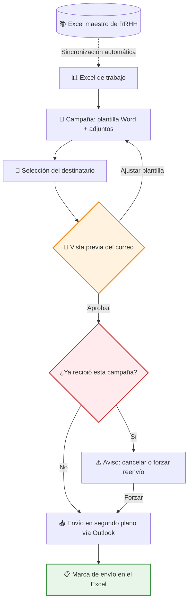
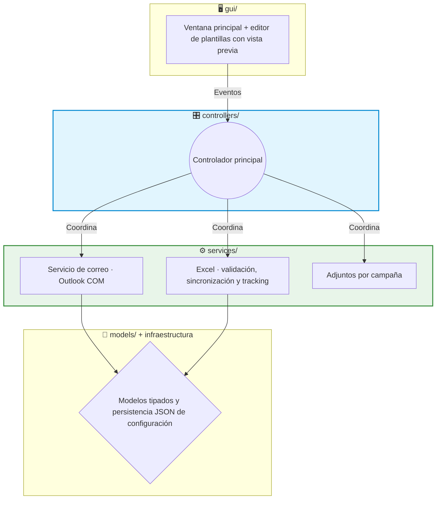

# 📧 Showcase: Email Auto — Comunicaciones de RRHH personalizadas y sin duplicados

Este proyecto es una aplicación de escritorio que automatiza las comunicaciones recurrentes de RRHH (bienvenidas, cumpleaños, formación, accesos, uniforme...) personalizándolas por destinatario. Lee los datos del Excel que RRHH ya mantiene, rellena plantillas corporativas de Word, muestra una vista previa fiel del correo y lo envía desde el propio Outlook del usuario, dejando registrado el envío en el mismo Excel para que nadie reciba dos veces la misma comunicación.

> [!NOTE]
> **Aviso de Confidencialidad**
> Como es un proyecto desarrollado para una empresa, ciertos detalles internos, plantillas y partes del código están protegidos por confidencialidad. Sin embargo, en este documento explico a grandes rasgos la estructura principal y cómo funciona la aplicación.

## 🔎 ¿Qué hace la aplicación?

Las comunicaciones recurrentes de RRHH se repiten cada semana: mismos textos, distinto nombre, distinta fecha. Hacerlo a mano consume horas y produce errores incómodos — el clásico "a María le llegó el correo de Juan". Con esta herramienta:

- Los datos se cargan desde el Excel de siempre, y cada correo se rellena solo con los datos de su destinatario.
- Cada tipo de comunicación es una **campaña** configurable desde la propia app: su plantilla Word, sus adjuntos fijos y su columna de seguimiento en el Excel. RRHH puede crear o borrar campañas sin tocar código.
- Antes de enviar nada, se ve el correo **exactamente** como lo recibirá la persona: su nombre, sus datos, sus adjuntos.
- Los correos salen desde el Outlook del usuario (su cuenta o un buzón compartido configurado), con CC por defecto, al email corporativo o al personal según el caso.
- Todo queda registrado: cada envío se marca en la columna de la campaña dentro del Excel y, si se intenta repetir, la app avisa antes de reenviar — además de la copia nativa en la carpeta de Enviados.

## 🔄 Flujo de trabajo

La vista previa renderiza el HTML resultante de fusionar la plantilla con la fila del Excel, incluyendo los adjuntos por perfil. Es el control de calidad previo al disparo: lo que se aprueba es lo que llega.

## 🏗️ Arquitectura del Proyecto

La aplicación nació como una herramienta rápida y sobrevivió a su propio éxito: el uso real forzó (y justificó) un **refactor completo de script monolítico a arquitectura por capas** en la V2.0, con responsabilidades separadas y una suite de tests como red de seguridad.

1. 🖥️ **GUI (`gui/`)**: solo presentación. Incluye el editor de plantillas con vista previa (conversión `.docx` → HTML con mammoth) y delega toda acción en los controladores.
2. 🎛️ **Controladores (`controllers/`)**: coordinan el flujo completo — reciben eventos de la GUI, consultan servicios, lanzan el worker de envío y devuelven resultados a pantalla.
3. ⚙️ **Servicios y lógica de negocio**: integración con Outlook vía COM (`OutlookService`), validación del Excel de destinatarios, sincronización con el Excel maestro (`ExcelSyncService`), registro de envíos (`TrackingManager`) y gestión de adjuntos por campaña. El `OutlookService` es Python puro, separado del worker de Qt: así se puede *mockear* en los tests sin riesgo de enviar correos reales.
4. 📐 **Modelos e infraestructura**: estructuras de datos explícitas en lugar de diccionarios sueltos (los errores de forma se detectan pronto) y persistencia JSON de la configuración del usuario, con tests propios.

## ✨ Características Técnicas Destacadas

*   🔐 **Outlook COM en lugar de SMTP**: el envío se hace a través del cliente Outlook de escritorio (automatización COM con **pywin32**). Las consecuencias de esta decisión son muy valiosas en un entorno corporativo: cero credenciales que almacenar, identidad real del remitente, los envíos quedan en el buzón (auditoría nativa) y se respetan las políticas del tenant sin registrar aplicaciones en Azure.
*   🔁 **Idempotencia de envíos**: antes de enviar, la app busca en el Excel si esa persona ya recibió esa campaña. Si es así, muestra un aviso con "Cancelar" como opción por defecto y exige confirmar explícitamente para reenviar. Tras un envío correcto, marca la celda correspondiente, y si el Excel está abierto y bloqueado por otro usuario lo detecta y avisa en lugar de fallar en silencio.
*   ⚡ **Envío asíncrono con QThread**: un worker dedicado ejecuta el envío fuera del hilo de la interfaz y comunica el progreso y los errores mediante señales de Qt, con el ciclo COM (`CoInitialize` / `CoUninitialize`) bien cerrado en su propio hilo. La GUI nunca se congela mientras Outlook trabaja.
*   📝 **Plantillas Word propiedad de RRHH**: las plantillas son `.docx` con placeholders (**docxtpl**) que se convierten a HTML de correo con **mammoth**. Quien mantiene los textos es el usuario de negocio, en Word, sin ciclo de desarrollo por medio.
*   👀 **Sincronización del Excel en caliente**: un watcher (**watchdog**) vigila el Excel maestro de RRHH y, cuando cambia, cruza sus datos con el Excel de trabajo usando claves primarias (email personal / email corporativo): actualiza registros existentes, inserta altas nuevas y detecta huérfanos, y avisa en pantalla con un resumen de los cambios. El watcher se pausa mientras la app escribe el tracking, para no reaccionar a sus propios cambios. El parseo además normaliza cabeceras y tolera las irregularidades típicas de un Excel mantenido a mano.
*   📎 **Adjuntos por campaña con límites**: cada campaña guarda sus propios adjuntos (PDF o Excel) en una carpeta de la app, validados por tipo, número máximo de ficheros y tamaño total configurables, para que ningún correo se quede bloqueado en Outlook por exceso de tamaño.
*   🧪 **Refactor respaldado por tests**: la evolución V0.2 → V2.0.3 (10 builds publicados) se hizo sobre una suite de **19 tests** (pytest) que cubre configuración y su persistencia, el worker de envío, seguridad y el sistema de plantillas — la red que permitió refactorizar sin romper.

## 📈 Evolución del producto

| Versión | Hito |
|---|---|
| V0.2 | Primera versión útil en producción interna |
| V0.2.1 – V0.2.3 | Estabilización y correcciones con uso real |
| V1.0 | Producto consolidado |
| V2.0 | Refactor completo a arquitectura por capas |
| V2.0.1 – V2.0.3 | Endurecimiento post-refactor (versión actual) |

## 🚀 Estado del Proyecto

Es la aplicación con más recorrido del portfolio (~3.000 líneas) y un producto maduro en uso interno. Hoy el envío, las plantillas y la configuración están cubiertos por tests. Los siguientes pasos naturales son ampliar la cobertura de tests sobre los controladores y la sincronización de Excel, añadir el envío por lotes a varios destinatarios en una sola pasada (hoy el flujo es un correo por destinatario, con vista previa y control de duplicados en cada uno) y valorar una cola de reintentos para envíos fallidos.

---

**Iván Herrero - AI & Automation Specialist**