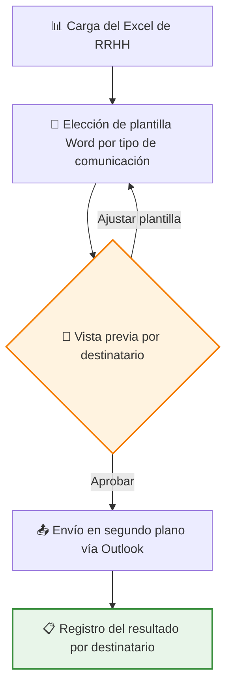
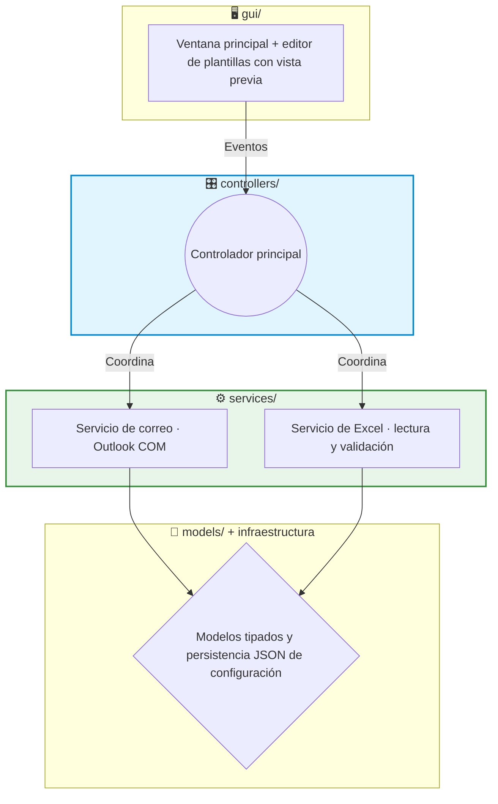

# 📧 Showcase: Email Auto — Comunicaciones de RRHH personalizadas a escala

Este proyecto es una aplicación de escritorio que automatiza las comunicaciones recurrentes de RRHH (bienvenidas, cumpleaños, formación, accesos, uniforme...) personalizándolas por destinatario. Lee los datos del Excel que RRHH ya mantiene, rellena plantillas corporativas de Word, muestra una vista previa fiel de cada correo y los envía desde el propio Outlook del usuario, dejando registro de cada envío.

> [!NOTE]
> **Aviso de Confidencialidad**
> Como es un proyecto desarrollado para una empresa, ciertos detalles internos, plantillas y partes del código están protegidos por confidencialidad. Sin embargo, en este documento explico a grandes rasgos la estructura principal y cómo funciona la aplicación.

## 🔎 ¿Qué hace la aplicación?

Las comunicaciones recurrentes de RRHH se repiten cada semana: mismos textos, distinto nombre, distinta fecha. Hacerlo a mano consume horas y produce errores incómodos — el clásico "a María le llegó el correo de Juan". Con esta herramienta:

- Los datos se cargan desde el Excel de siempre, y cada correo se rellena solo con los datos de su destinatario.
- Antes de enviar nada, se ve el correo **exactamente** como lo recibirá cada persona: su nombre, sus datos, sus adjuntos.
- Los correos salen desde la cuenta corporativa de Outlook del usuario, como si los hubiera escrito él.
- Todo queda registrado: qué se envió, a quién y con qué resultado — además de la copia nativa en la carpeta de Enviados.

## 🔄 Flujo de trabajo

La vista previa renderiza el HTML resultante de fusionar la plantilla con la fila del Excel, incluyendo los adjuntos por perfil. Es el control de calidad previo al disparo: lo que se aprueba es lo que llega.

## 🏗️ Arquitectura del Proyecto

La aplicación nació como una herramienta rápida y sobrevivió a su propio éxito: el uso real forzó (y justificó) un **refactor completo de script monolítico a arquitectura por capas** en la V2.0, con responsabilidades separadas y una suite de tests como red de seguridad.

1. 🖥️ **GUI (`gui/`)**: solo presentación. Incluye el editor de plantillas con vista previa (conversión `.docx` → HTML con mammoth) y delega toda acción en los controladores.
2. 🎛️ **Controladores (`controllers/`)**: coordinan el flujo completo — reciben eventos de la GUI, consultan servicios, lanzan el worker de envío y devuelven resultados a pantalla.
3. ⚙️ **Servicios (`services/`)**: la lógica de negocio — integración con Outlook vía COM y lectura/validación del Excel de destinatarios. Sin dependencias de la GUI: son testeables de forma aislada, y así se testean.
4. 📐 **Modelos e infraestructura**: estructuras de datos explícitas en lugar de diccionarios sueltos (los errores de forma se detectan pronto) y persistencia JSON de la configuración del usuario, con tests propios.

## ✨ Características Técnicas Destacadas

*   🔐 **Outlook COM en lugar de SMTP**: el envío se hace a través del cliente Outlook de escritorio (automatización COM con **pywin32**). Las consecuencias de esta decisión son muy valiosas en un entorno corporativo: cero credenciales que almacenar, identidad real del remitente, los envíos quedan en el buzón (auditoría nativa) y se respetan las políticas del tenant sin registrar aplicaciones en Azure.
*   ⚡ **Envío asíncrono con QThread**: un worker dedicado ejecuta los envíos fuera del hilo de la interfaz, comunicando el progreso mediante señales de Qt. La GUI nunca se congela, ni con lotes grandes — el ordenador sigue siendo usable durante todo el proceso.
*   📝 **Plantillas Word propiedad de RRHH**: las plantillas son `.docx` con placeholders (**docxtpl**) que se convierten a HTML de correo con **mammoth**. Quien mantiene los textos es el usuario de negocio, en Word, sin ciclo de desarrollo por medio.
*   👀 **Vigilancia del Excel en caliente**: un watcher (**watchdog**) detecta modificaciones del archivo mientras la aplicación está abierta, para no trabajar nunca con datos obsoletos. El parseo además tolera las irregularidades típicas de un Excel mantenido a mano.
*   🧪 **Refactor respaldado por tests**: la evolución V0.2 → V2.0.3 (10 builds publicados) se hizo sobre una suite de **19 tests** (pytest) que cubre configuración y su persistencia, el worker de envío, seguridad y el sistema de plantillas — la red que permitió refactorizar sin romper.

## 📈 Evolución del producto

| Versión | Hito |
|---|---|
| V0.2 | Primera versión útil en producción interna |
| V0.2.1 – V0.2.3 | Estabilización y correcciones con uso real |
| V1.0 | Producto consolidado |
| V2.0 | Refactor completo a arquitectura por capas |
| V2.0.1 – V2.0.3 | Endurecimiento post-refactor (versión actual) |

## 🚀 Estado del Proyecto

Es la aplicación con más recorrido del portfolio (~3.000 líneas) y un producto maduro en uso interno. Hoy el envío, las plantillas y la configuración están cubiertos por tests. Los siguientes pasos naturales son ampliar la cobertura de tests sobre los controladores y valorar una cola de reintentos para envíos fallidos.

---

**Iván Herrero - AI & Automation Specialist**